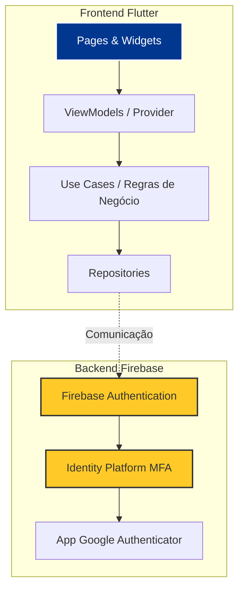
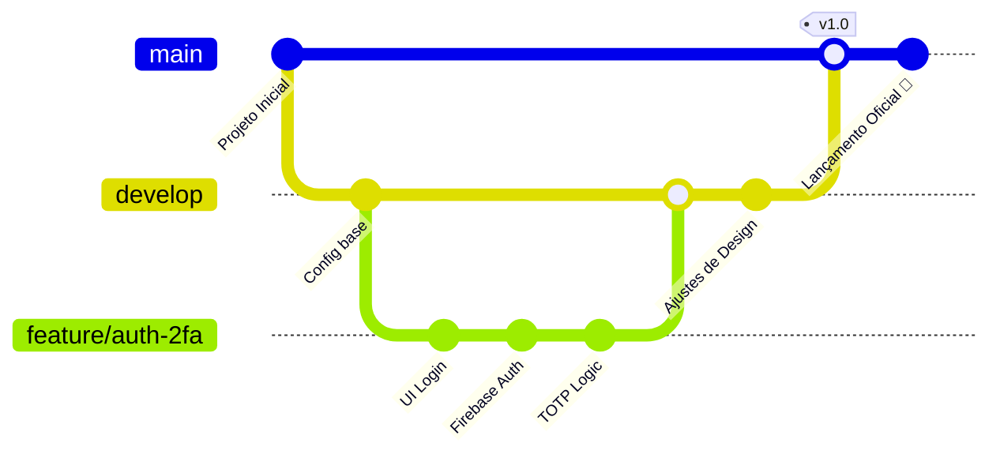

# 🎓 Euro Academy - Plataforma de Treinamentos

> **Status:** 🚀 Lançamento Oficial (v1.0) | Otimizado para Desktop/Laboratórios

O **Euro Academy** é uma plataforma corporativa de gestão de treinamentos desenvolvida para a **Eurofarma**. Este projeto é fruto do 6º semestre de Sistemas de Informação na **FIAP** e tem como foco principal a alta fidelidade visual e a segurança de acesso aos dados.

## 📸 Interface de Login

## 📸 Interface de @2FA

## 📸 Interface logada

## 🛠️ Stack Tecnológica
- **Frontend:** [Flutter](https://flutter.dev) (Motor Gráfico: **CanvasKit** para Web)
- **Backend & Auth:** [Firebase](https://firebase.google.com) (Authentication & Identity Platform)
- **Segurança:** Autenticação Multifator (2FA/TOTP) via Aplicativo Autenticador.
- **Gerência de Estado:** Provider
- **Padrões & Arquitetura:** Clean Architecture + MVVM (Model-View-ViewModel) + Injeção de Dependências (GetIt).

## 🏗️ Arquitetura do Sistema

O projeto segue os princípios da Clean Architecture para separar regras de negócio da interface visual e da comunicação com o servidor:

## 🚀 Como executar o projeto localmente
Para desenvolvedores, professores ou colegas de grupo que desejam clonar e testar o projeto, siga o manual abaixo.

⚠️ Atenção: Como o design do projeto foi projetado especificamente para monitores, ele deve ser executado no navegador para garantir que os gradientes e vetores funcionem perfeitamente.

Passo 1: Pré-requisitos
Flutter SDK instalado.

Navegador Google Chrome.

Um aplicativo de Autenticação no celular (Google Authenticator, Authy, Microsoft Authenticator, etc.) para testar o fluxo de 2FA.

Passo 2: Clonagem e Setup

Abra o seu terminal e execute:
# 1. Clone este repositório
git clone [https://github.com/CallmeKdu/eurotrainer-platform.git](https://github.com/CallmeKdu/eurotrainer-platform.git)

# 2. Entre na pasta do projeto
cd eurotrainer_platform

# 3. Baixe todas as dependências
flutter pub get

Passo 3: Executando o App
Para iniciar o servidor local, utilize o comando:

flutter run -d chrome

## 🌳 Fluxo de Trabalho (Gitflow)

O desenvolvimento da v1.0 seguiu o padrão Gitflow, garantindo que a `main` estivesse sempre estável enquanto as funcionalidades eram testadas na `develop`.

Desenvolvido por EuroTrainers 
Carlos Eduardo Martins Freire | Maria Alice Sousa Santos | Pedro Henrique Lima | Thaís Mari Costa Lopes | Projeto Acadêmico FIAP - 2026
